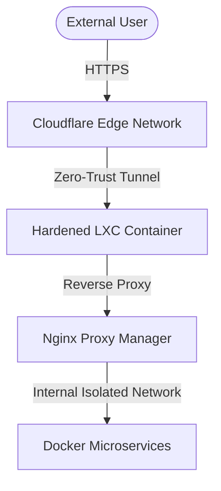

---
title: "Automated Homelab Infrastructure: Secure Containerized Services"
date: 2026-06-29
draft: false
summary: "An enterprise-grade homelab architecture utilizing Proxmox VE, automated Docker environments, and a hardened zero-trust network topology."
tags: ["homelab", "proxmox", "docker", "security", "cloudflare"]
categories: ["Infrastructure"]
---


## Architectural Overview

This project details the architecture, deployment pipeline, and security hardening protocols of my private homelab environment. The infrastructure is engineered to separate public-facing applications from internal core data services while maintaining strict configuration management via Git.

The system scales across isolated virtualization layers, routing external traffic through encrypted overlay paths to eliminate open inbound firewall ports.



---

## Technology Stack

| Layer | Component | Functional Utility |
| --- | --- | --- |
| **Hypervisor** | Proxmox VE | Bare-metal virtualization & resource allocation |
| **Container Engine** | Docker & Docker Compose | Lightweight microservice abstraction |
| **Networking** | Cloudflare Tunnels & Nginx | Zero-Trust routing and SSL/TLS termination |
| **Operating System** | Alpine Linux / Debian | Hardened, minimal-footprint target nodes |

---

## Security Hardening Matrix

To achieve an enterprise-grade posture, the following system-level security controls were implemented across the cluster:

### 1. Unprivileged Containers & User Namespaces

All Proxmox LXC utility nodes are strictly configured as **unprivileged**. This maps the container's root user UID `0` to an unprivileged high-range UID on the physical host machine, completely eliminating container-breakout exploitation vectors.

### 2. Micro-Segmentation & Firewall Topologies

Services are partitioned into isolated network segments.

* Databases have zero route-paths to the open internet.
* Reverse-proxy nodes are isolated inside a dedicated DMZ virtual network segment.

### 3. SSH Configuration Hardening

Root passwords are disabled across all infrastructure nodes. Access is strictly authenticated via cryptographic public keys.

```bash
# /etc/ssh/sshd_config snippet
PermitRootLogin no
PasswordAuthentication no
PubkeyAuthentication yes
X11Forwarding no

```

---

## Core Deployment Blueprint

Below is an abstract configuration matrix showing my standardized `docker-compose.yml` blueprint used to spin up network application routing stacks. It implements resource limits and strict non-root user execution environments.

```yaml
version: "3.8"

services:
  reverse-proxy:
    image: jc21/nginx-proxy-manager:latest
    container_name: network_ingress_proxy
    restart: unless-stopped
    ports:
      - "80:80"
      - "443:443"
    environment:
      - DB_SQLITE_FILE=/data/database.sqlite
    volumes:
      - ./nginx/data:/data
      - ./nginx/letsencrypt:/etc/letsencrypt
    deploy:
      resources:
        limits:
          cpus: '0.50'
          memory: 512M
    networks:
      - proxy_ingress_network

networks:
  proxy_ingress_network:
    driver: bridge
    internal: false

```

---

## Automated Deployment Pipeline

The portfolio environment itself is fully integrated into a modern CI/CD architecture. Local writes are tracked via Git, verified through a static compilation layer, and automatically published to edge nodes upon a repository push.

1. **Local Development:** Configurations are built and verified locally on an Arch Linux environment.
2. **Version Tracking:** State shifts are pushed up to a secure remote Git tracking node.
3. **Automated Edge Compilation:** Cloudflare Pages catches the webhook, pulls the compilation schema, upgrades the build runner environment natively via environment variables, and pushes global assets to production mirrors.

---

## Key Engineering Takeaways

* **Defense in Depth:** Perimeter firewalls are useless if the internal nodes are flat. Segmenting Docker applications into distinct internal container networks prevents horizontal pivot attacks if a single application vulnerability is compromised.
* **Infrastructure as Code:** Documenting cluster configurations through reproducible blueprints dramatically decreases Disaster Recovery windows from hours to mere minutes.